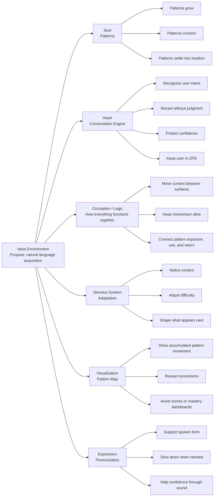
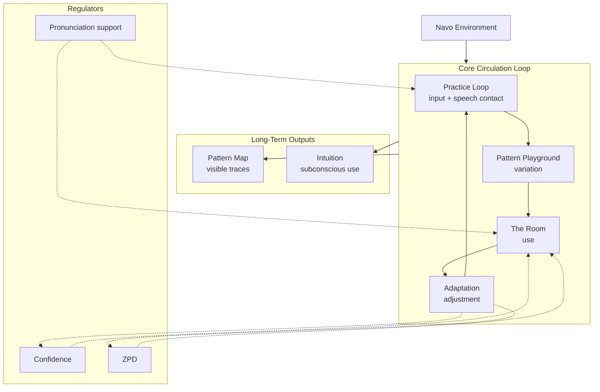

# Navo

Navo is a conversational language learning system built around natural exposure, phrase movement, and immersive voice interaction.

It is not a traditional language learning app.

No lessons.  
No scores.  
No streaks.  
No XP.  
No grammar drills.  

Navo is designed to feel more like entering a language environment than completing a course.

---

## Core Idea

Most language apps turn learning into tasks.

Navo takes a different approach:

- hear phrases
- speak them
- move them through nearby patterns
- carry them into conversation
- slowly build familiarity through repeated exposure and interaction

The goal is not to explicitly “study” the language.

The goal is to live around it long enough for structure, rhythm, and meaning to start becoming familiar.

---

## Core Environments

### Practice Loop

Audio-first phrase exposure.

The user hears a phrase, repeats it, reveals the phrase, and can explore its structure further.

Practice Loop is not a quiz or flashcard system. It is a calm repetition surface for phrase contact.

### Pattern Playground

A phrase transformation space.

Pattern Playground shows a phrase, compressed meaning, and nearby phrase paths. The user can hear variations, notice changes, and carry a phrase into The Room.

The goal is pattern perception, not explicit grammar instruction.

### The Room

A voice-first conversational environment.

The Room is where phrases become conversation. It should feel like entering a language space, not talking to a tutor.

The Room avoids correction-heavy behavior and explicit teaching unless absolutely necessary.

### Pattern Map

A future-facing continuity surface.

The Pattern Map is not a skill tree or progress chart. It is intended to represent movement through language: exposure traces, phrase relationships, recurring structures, and pathways the user has lived around.

---

## Current Product Direction

Navo is moving toward a local-first continuity system.

The next major layer is not “more features.” It is memory.

Planned continuity work includes:

- local exposure traces
- phrase movement traces
- immersion profile storage
- Pattern Map foundations
- session continuity
- later sync/account support

The account system is primarily a continuity system, not a traditional profile/dashboard.

---

## Product Principles

Navo should avoid:

- lessons
- quizzes
- scores
- XP
- streaks
- levels
- skill trees
- progress bars
- grammar labels
- correction-heavy UI
- school-like onboarding

Navo should prioritize:

- natural conversation
- audio exposure
- phrase movement
- structural familiarity
- subtle adaptation
- calm interface design
- local-first persistence where possible

---

## Tech Stack

- React
- Vite
- React Router
- Supabase Auth + Postgres JSON persistence
- Browser Speech Recognition
- Browser Speech Synthesis
- IndexedDB / local storage for local-first data
- React Icons

---

## Project Structure

```txt
src/
  components/
    LandingPage.jsx
    ImitationLoop.jsx
    PlaygroundScreen.jsx
    CallScreen.jsx
    AccountPage.jsx
    SessionsPage.jsx
    SettingsPage.jsx
    AboutPage.jsx
    AccessPage.jsx
    NavoNav.jsx
    NavoFooter.jsx

  data/
    phrasePatterns.js
    units.js

  services/
    phraseGenerator.js
    playgroundSeed.js
    playgroundSequenceBuilder.js
    conversation.js
    moveEngine.js
    storage.js
    tts.js
    wordMeaning.js

  styles/
    LandingPage.css
    ImitationLoop.css
    PlaygroundScreen.css
    CallScreen.css
    AccountPage.css
    SessionHistory.css
    SettingsPage.css
    AboutPage.css
    AccessPage.css
## Development

### Install dependencies

```bash
npm install
```

### Configure Supabase for Account System v1

1. Copy `.env.example` to `.env`.
2. Set `VITE_SUPABASE_URL` and `VITE_SUPABASE_ANON_KEY`.
3. Run the SQL in `supabase/navo-account-system-v1.sql` inside your Supabase project.

If the Supabase environment variables are missing, Navo still runs locally and the account UI stays in local-only mode.

### Run locally

```bash
npm run dev
```

Then open the local URL shown in your terminal, usually:

```txt
http://localhost:5173
```

### Build for production

```bash
npm run build
```

### Preview production build

```bash
npm run preview
```

---

## Browser Support

Navo depends on browser speech APIs.

For best results, use:

- Chrome
- Edge

Speech recognition support may be limited or inconsistent in Safari and Firefox.

---

## Local-First Notes

Navo currently favors local-first behavior where possible.

User-facing data such as sessions, preferences, and future continuity traces should remain understandable, exportable, and deleteable.

Navo should not add tracking or analytics that makes the user feel monitored.

### Account System v1 privacy boundary

Supabase-backed Navo Accounts persist:

- account identity
- language settings
- voice settings
- immersion profile
- exposure traces
- movement traces
- basic account metadata

Supabase-backed Navo Accounts do not persist:

- full Room conversation transcripts
- full session exchange bodies
- private conversation archive
- audio
- voice biomarker or prosody data

Room conversations remain local to the device in Account System v1.
Conversation data can still be exported locally from the device.
Verbatim Room trace text also remains local-only; cloud continuity keeps only derived non-verbatim Room signals.

---

## Design Direction

Navo’s interface should feel:

- calm
- immersive
- intentional
- modern
- quiet but not empty

It should not feel like:

- a classroom
- a gamified app
- a productivity dashboard
- a flashcard tool
- a chatbot wrapper

---

## Status

Navo is an active prototype.

Current focus:

1. Frontend product shell
2. Local continuity layer
3. Immersion profile storage
4. Pattern Map foundations
5. Account-owned continuity and sync

---

## Product Model

Navo is organized around a language environment rather than lessons, levels, or scores.

This model is a product compass, not a strict implementation diagram.



---

## Circulation Model

Circulation describes how Navo keeps patterns, context, and momentum moving between surfaces so the product feels like one environment instead of separate features.

This model is also a product compass, not a strict implementation diagram.



---

## License

License not yet specified.

